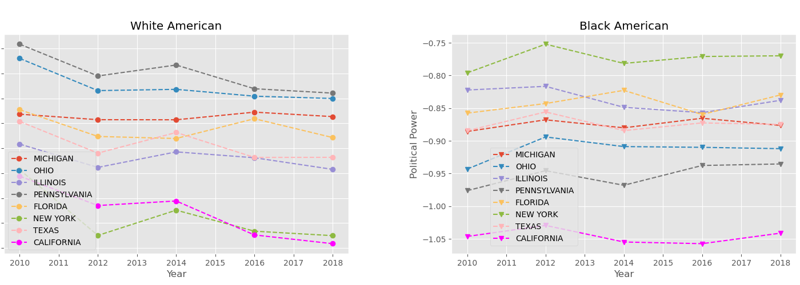
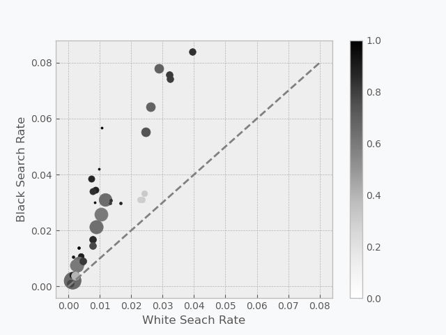
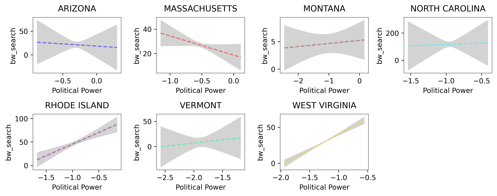
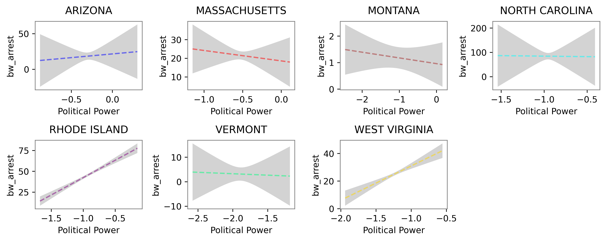
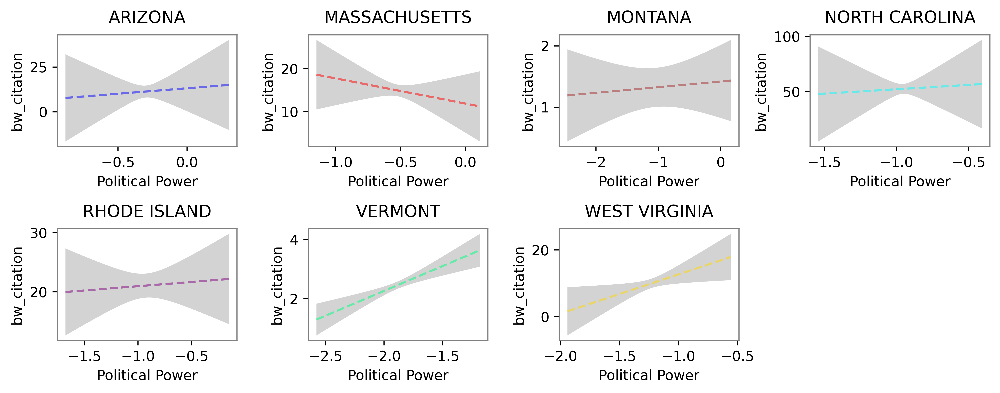
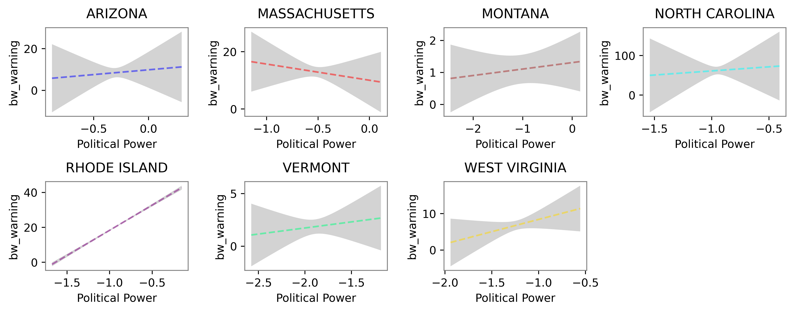

---
# Feel free to add content and custom Front Matter to this file.
# To modify the layout, see https://jekyllrb.com/docs/themes/#overriding-theme-defaults

layout: page
bigimg: ["/img/cover_image_1.png", "/img/cover_image_2.png", "/img/cover_image_3.png"]
title: Political Stops
subtitle: Does Political Power Impact Racial Disparities in Police Stops?
---

**No one likes being pulled over, but**
# Did you know...

It has been shown that African American in the US has been suffering racial disparities in traffic police stops across the country. The Stanford Open Policing Project has demonstrated that black and Hispanic drivers are stopped by police at a higher rate without more evidence, and the bar for searching black and Hispanic drivers is lower than that for searching white drivers, suggestive of racial profiling. 

(For more details about this work, check out [their project website](https://openpolicing.stanford.edu/))

What their work has also informed us (by studying the legalization of recreational marijuana) is that policy interventions have the power to mitigate these racial disparities.

How can such policy interventions be made? We notice that ***political power*** is an important factor in it. Intuitively, with political power, disparities are less likely to grow because it would lead to attention, complaints, concern, and political actions to reduce them. Without political power, disparities can continue with impunity and with little relative attention.

In this project, we aim to analyze the political power of black people in ... states and try to figure out whether the political power has an impact on racial disparities in terms of police stops.

---

## How Do We Measure Political Power?
A group with high political power must be able to exercise certain amount of influence on the political procedures, therefore we identify **presence**, and **voice** as two latent variables linked to political power. Other two obvious linked factors are **wealth** (supporting research:[[1]](https://doi.org/10.1016/j.jebo.2014.08.006), [[2]](https://www.sciencedirect.com/science/article/abs/pii/S0967067X0400008X)) and **education** (supporting research: [[3]](https://www.jstor.org/stable/1050712?seq=1#metadata_info_tab_contents)).

More concretely, we use **proportion of population**, **proportion of voted population** to represent **presence** and **voice**. Indeed, as a group grows in size, it becomes harder to ignore, thus their political power grows. Presence without voice (voting) can be meaningless. We use **median personal income** and **proportion of sucessfully graduated from college** to represent **wealth** and **education**. Indeed, a group with more wealth is able to be more active in politics in order to defend their interests. And education is a highly relevant factor to both political activities and wealth. In the following figures, we demonstrate the first two variables of some states to let you have a clue how these variables change through years.

<iframe width="800" height="500" frameborder="0" scrolling="no" src="//plotly.com/~doub7eli/1.embed"></iframe>

### How Do We Build an Index for Political Power?

Data about policing stops are available at the [webpage](https://openpolicing.stanford.edu/) of Stanford Open Policing Project. In addition, we collect the data of *population* and *voted population* from [American Community Survey (ACS)](https://www.census.gov/en.html) database. It contained the result of elections of all states in US every two years (elections and midterm election). And we pick the data from 2010 to 2018. Besides, we collect dataset about **wealth** and **education** from [IPUMS USA](https://usa.ipums.org/usa/).

After appropriate pre-processing, we then use **Factor Analysis** to construct a single dimension of political power based on the four variables described above. The variance expalined is *79.07%*.

## How Has the Political Power Changed?

With the help of Factor Analysis, we calcuted the political power of both white and black people in multiple states over years.

Not surprisingly, we found the factor describing political power ranges from -1.21 to -0.22, with mean -0.96 and median -1.04 for black people, while for white people, it ranges from -0.67 to 1.35, with mean 0.96 and mediun 1.02. Indicating the huge superioiry of white people's political power over black people's political power. In the following, we plot the political power of black and white Americans in 8 big states. Note that the range of y axis is different in two figures. We can see that white American keeps its superiority on political power from 2010 to 2018.

## First Glance of the Analysis
One might assume that a group with greater political power will suffer from less raical dispairities in traffic stop, is that True? In the following, we plot the figure the white search rate and black search rate, with the size indicating the population of each state, and *the color indicating the difference between white's political power and black's political power*.

Clearly, we can see that the point with deeper color deviate more from the line of 'y=x', indicating that the phenomenon of racial disparity is more serious in the place where the difference between white's and black's political power is large. This is in line with our guess. And in the following, we will carry our regression analysis to get a clearer view.

## Does Political Power Impact Racial Disparities in Police Stops?

To see through this problem, we conducted a exploratory analysis using data from 15  American cities. These cities are CA San Diego, CA San Francisco, CA Stockton, CT Hartford, LA New Orleans, NC Charlotte, NC Durham, NC Fayetteville, NC Greensboro, NC Raleigh, NC Winston Salem, OH Columbus, PA Pittsburgh, TN Nashville,  VT Burlington. Since we need the data of search rate, warning rate citation rate, and arrest rate, these 15 ones are all the cities that meet the data requirements. What's more, the number of years with valid data varies by city. In summary, we use data from 15 cities with 151 valid years. And all the data can be found [here](https://openpolicing.stanford.edu/data/).

Table: The description of four outcomes

|       | bw_search | bw_arrest | bw_citation | bw_warning |
| :---: | :-------: | :-------: | :---------: | :--------: |
| count | 15.000000 | 15.000000 |  15.000000  | 15.000000  |
| mean  | 2.116278  | 1.651394  |  0.957276   |  1.205424  |
|  std  | 1.199010  | 1.005246  |  0.598655   |  0.658396  |
|  min  | 0.335821  | 0.130000  |  0.121225   |  0.085131  |
|  25%  | 1.308114  | 0.990718  |  0.589332   |  0.723890  |
|  50%  | 2.017767  | 1.676768  |  0.922837   |  1.195433  |
|  75%  | 3.092054  | 2.110031  |  1.144677   |  1.543879  |
|  max  | 4.367405  | 3.833067  |  2.341822   |  2.515497  |

For each outcome, we calculate the black-white ratio, As a reminder, if the calculated value is 1, then black and white drivers are seemed to be equally treated. Values below 1 indicate that white drivers are more possible to commit this outcome than black drivers, while values above 1 indicate that black drivers are more possible to commit this outcome than white drivers. Table 1 presents the summary statistics for these variables. 

Looking at the mean values, searches are 119 percent more common for black drivers than whites. Compared to the search rate, warnings and citations are almost equally likely. And arrests are 65 percent more likely among black drivers, on average.  The minima, 25th percentile value, median, 75th percentile value, and the maxima show the full range of each variable across the years. Searches have a maximum of more than 4 times likely among black drivers. While arrests have a maximum of about 3.8 times likely among black drivers. With a good range of variability for each variable, we test if our theory about political power can explain this variance.

## Regression Analysis

After the obtaining the political power, we explore the the influence of political power on the four outcomes, from the state level. Also from the Stanford Open Policing Project, we have 7 states that meet the data criteria, s.t. Arizona, Massachusetts, Montana, North Carolina, Rhode Island, Vermont, West virginia. And we values our hypothesis from 2010 to 2014. We conducted a regression analysis of political power of the above seven states regarding four outcomes, and the results are shown in the figure.

Figures shows the results of the regressions predicting the black-white outcome ratios. Following from our hypotheses, we expect that the coefficients for our political power should push the predicted outcome to equality. For search rate ratios, warning rate ratios, and arrest rate ratios, this should be a negative coefficient; while for citation rate ratios, this should be positive. And indeed we can find this result in most states.

Figure: Search rates varying with political power

Figure: Arrest rates varying with political power

Figure: Citation rates varying with political power

Figure: Warning rates varying with political power

Political power is strongly and significantly related to three of the four outcomes reviewed, though its effect on arrest ratios does not reach statistical significance. We can explore the impact of political power among black and white drivers by looking at simple plots. These figures show how the outcome rate ratio is expected to change across the political power variable. The regression line, which is the predicted value from the regression, is a colored solid line; and the 90 percent confidence interval around the regression line is the shadowed part. Four figures are presented in identical format. These are the search ratio, arrest ratio, citation ratio, and warning ratio. On the x-axis is the black political power index and on the y-axis the relevant ratio.

---

## Conclusion

We showed how to measure political power and build an index for it. We demonstrated how the political power of white and black people in the US has changed over the last few years. We provided enough evidence that political power does impact racial disparities in police stops. Our work may inspire that minorities in the US should endeavour to become more represented in politics and thus gain more political power for their own interests.

---